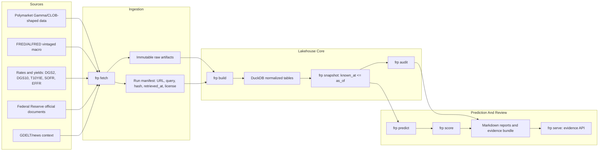

# Fed Rate Wayback Machine

`frp` is a replay tool for Fed-rate prediction markets. It answers one core question:

> As of time T, what was knowable, what was excluded as future information, what would a simple forecast say, and how did that compare with Polymarket and the final Fed decision?

The product is not a trading bot. It is a way to build a trustworthy dataset: keep raw files, record where every row came from, track when each fact became knowable, run audit checks, produce a forecast, and write reports.

## What Is Built

- Reproducible fixture replay for a resolved June 2026 Fed decision market.
- Live FRED/ALFRED fetch mode using `FRED_API_KEY` from `.env.local` or the environment.
- Rates/yields context: `DGS2`, `DGS10`, `T10YIE`, `SOFR`, `EFFR`, plus target-rate and macro series.
- Fed document and GDELT/news fixture ingestion with provenance and cutoff filtering.
- Polymarket outcome mapping by token ID, with market odds used only as benchmark data.
- Point-in-time snapshots where prediction inputs must satisfy `known_at <= as_of`.
- Audit reports, leakage canary, PII/license/provenance checks, and excluded-future examples.
- Baseline forecast, Brier scoring, always-hold baseline, and Polymarket benchmark.
- Multi-event/horizon comparison harness for `T-30`, `T-14`, `T-7`, `T-3`, and `T-1` style replays.
- Evidence bundle JSON/Markdown and a local FastAPI service for app-readable access.
- Live July 2026 forecast lane, marked pending until that event resolves.

The checked-in multi-event configs are fixture-backed examples. They prove repeated scoring works. Stronger prediction-quality claims require replacing those examples with retrievable per-event Polymarket history and official event-specific raw artifacts.

## Architecture



## Quickstart

```bash
python3 -m venv .venv
source .venv/bin/activate
python -m pip install -e ".[dev]"

frp run \
  --event-config configs/events/fomc_2026_06.yaml \
  --as-of 2026-04-30T20:00:00Z

frp verify-repro \
  --event-config configs/events/fomc_2026_06.yaml \
  --as-of 2026-04-30T20:00:00Z \
  --mode fixture

pytest -q
```

Generated data lands in ignored `data/` directories. Reports land in ignored `outputs/`.

## Live FRED/ALFRED

The reproducible fixture path does not need an API key. Live mode uses the FRED API key in `.env.local`:

```bash
frp run \
  --event-config configs/events/fomc_2026_06.yaml \
  --as-of 2026-04-30T20:00:00Z \
  --source-mode live
```

The live connector records fresh raw FRED/ALFRED payloads but does not persist the key in manifests or raw artifacts. Fixture mode is the byte-stable path; live mode is for operational proof and refreshing evidence.

## Common Commands

```bash
frp discover-events --query "fed decision" --closed true --limit 10
frp validate-event --event-slug fed-decision-june-2026

frp run \
  --event-slug fed-decision-june-2026 \
  --as-of 2026-04-30T20:00:00Z

frp fetch --event-slug fed-decision-june-2026 --as-of 2026-04-30T20:00:00Z
frp build --run-id fomc_2026_06_20260430T200000Z
frp snapshot --run-id fomc_2026_06_20260430T200000Z --as-of 2026-04-30T20:00:00Z
frp audit --run-id fomc_2026_06_20260430T200000Z
frp predict --run-id fomc_2026_06_20260430T200000Z
frp score --run-id fomc_2026_06_20260430T200000Z
frp evidence --run-id fomc_2026_06_20260430T200000Z

frp compare \
  --configs-dir configs/events \
  --horizons T-30,T-14,T-7,T-3,T-1
```

Live July forecast:

```bash
frp run \
  --event-config configs/events/fomc_2026_07_live.yaml \
  --as-of 2026-06-20T20:00:00Z \
  --source-mode live
```

That command is intentionally `pending_resolution`; it should not produce Brier scores until the July decision resolves.

## API

Start the local API:

```bash
frp serve --host 127.0.0.1 --port 8000
```

Useful endpoints:

- `GET /events`
- `GET /evidence?event_id=fomc_2026_06&as_of=2026-04-30T20:00:00Z`
- `GET /snapshot/{snapshot_id}`
- `GET /market-odds?event_id=fomc_2026_06&as_of=2026-04-30T20:00:00Z`
- `GET /prediction?event_id=fomc_2026_06&as_of=2026-04-30T20:00:00Z`
- `GET /audit/{snapshot_id}`

Rule: no `as_of`, no evidence query.

## Data Sources

- Polymarket: event metadata, grouped outcome mapping, token IDs, and market benchmark odds.
- FRED/ALFRED: target range, effective funds, inflation, unemployment, payrolls, and vintaged macro observations.
- Rates/yields: 2Y, 10Y, breakevens, SOFR, and EFFR with publication-time alignment.
- Federal Reserve: official statement and implementation-note fixtures with known times and hashes.
- GDELT/news: tiny messy-source fixture slice to prove text provenance, audit, and future-evidence exclusion.

## Core Invariant

```sql
known_at <= as_of
```

Rows after the cutoff can be stored as resolution facts or future examples, but they cannot enter prediction inputs. The audit includes a leakage canary to prove the rule fails loudly when violated.

## More Detail

- [Wiki home](docs/wiki/Home.md)
- [Implementation plan](docs/plans/implementation_plan.md)
- [V2 GDELT-forward implementation plan](v2_plan.md)
- [Roadmap](docs/plans/roadmap.md)
- [Requirements coverage](docs/requirements_coverage.md)
- [Event configuration guide](docs/event_configuration.md)
- [Test plan](docs/test_plan.md)
- [Deployment plan](docs/deployment_plan.md)
