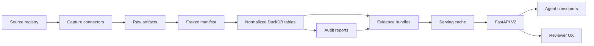

# V2 Plan: GDELT-Forward Reproducible Macro Evidence Platform

## 1. Summary

The project goal is to turn messy, real-world macro and news sources into a reproducible, audit-ready evidence system that can support forecasting agents and human review. V2 should move the system from fixture-first proof of concept to a real source ingestion platform, starting with live GDELT as the first major external news source.

The core system objective is:

1. Capture source data with full provenance.
2. Normalize it into a point-in-time dataset.
3. Audit source quality, leakage risk, coverage, licensing, and reproducibility.
4. Produce evidence bundles that an agent consumer can use without needing to know source-specific details.
5. Serve those evidence bundles through a high-throughput API path that can eventually support 10K+ agent tool calls per second.
6. Make it straightforward to add paid and proprietary sources while preserving source control, quality control, and redistribution boundaries.

V2 should remain narrow enough to ship incrementally: one live public source, one durable source registry, one reproducible freeze workflow, one improved evidence bundle schema, and one serving-cache path. The ambition is not raw data volume first. The ambition is trustworthy source handling that scales.

## 2. V2 Objectives

### 2.1 Primary Objectives

- Implement live GDELT ingestion as a first-class connector.
- Add a source registry that describes source metadata, licensing, quality checks, credentials, and redistribution policy.
- Add deterministic capture and freeze workflows so live pulls can be promoted into reproducible fixtures.
- Extend the normalized document data model with source metadata, temporal metadata, deduplication keys, and provenance fields.
- Add source-quality audit reports covering coverage, duplicates, temporal correctness, licensing flags, and capture failures.
- Add a V2 evidence bundle format that includes source lineage and audit status.
- Add a serving-cache layer so common API reads do not require ad hoc DuckDB queries.
- Add V2 FastAPI endpoints designed around immutable evidence bundles and explicit `as_of` requests.
- Define a paid/proprietary source adapter framework that supports Bloomberg, LSEG, Haver, Macrobond, CME FedWatch, FactSet, and internal research feeds later.

### 2.2 Secondary Objectives

- Improve the current benchmark workflow so events can be marked as fixture-backed, real-capture-backed, or production-source-backed.
- Add market baseline support beyond Polymarket, especially CME FedWatch or futures-derived rate expectations.
- Provide clear operational commands for source validation, capture, freezing, auditing, and serving-cache generation.
- Preserve the current lightweight stack where possible: Python, Typer, DuckDB, FastAPI, and JSON artifacts.

### 2.3 Non-Goals For V2

- Do not build a large distributed ingestion system yet.
- Do not store or redistribute full copyrighted article bodies by default.
- Do not build a full search engine in V2.
- Do not target true 10K QPS from a single local FastAPI process. V2 should create the architecture that can scale there.
- Do not add paid-source credentials or vendor integrations until the adapter framework and redaction model are in place.

## 3. Target Architecture

V2 should split the system into six layers:

1. Source registry: declares what each source is, how it can be used, and how it should be audited.
2. Capture layer: pulls raw source artifacts and records request/response provenance.
3. Freeze layer: promotes reviewed live artifacts into deterministic replay fixtures.
4. Normalize/build layer: converts raw artifacts into DuckDB tables with point-in-time semantics.
5. Audit/evidence layer: produces source quality reports and evidence bundles.
6. Serving layer: exposes immutable, precomputed evidence artifacts to agents and reviewers.



## 4. Source Strategy

### 4.1 V2 Public Sources

The immediate source set should focus on sources that support the rate-decision forecasting problem and the broader macro-event forecasting pattern.

| Source | Role | V2 Status | Notes |
| --- | --- | --- | --- |
| GDELT DOC 2.0 | Global news/article metadata and event context | Implement live connector | First live public news source. Store metadata by default. |
| GDELT 2.0 Event/GKG files | Historical global event/news signal | Plan for later V2 or V2.5 | Needed for longer history beyond DOC API limits. |
| FRED/ALFRED | Macro series and vintages | Keep and harden | Current project already supports live FRED/ALFRED. |
| Federal Reserve documents | Official meeting evidence | Keep and expand | Add more meeting-related document classes over time. |
| Polymarket | Market-implied probabilities | Keep and harden | Use as benchmark, not as primary explanatory evidence. |
| CME FedWatch or futures-derived probabilities | Institutional rate-market baseline | Add optional connector after registry | Important independent market baseline for Fed decisions. |

### 4.2 Paid And Proprietary Sources To Support Later

The system should be designed so paid/proprietary sources can be added without changing the core pipeline contract.

| Source Family | Example Use | Expected Handling |
| --- | --- | --- |
| Bloomberg Data License | Historical macro series, instruments, reference data | Batch files, strict license metadata, derived-only serving. |
| Bloomberg B-PIPE / SAPI | Real-time and server-side market data access | Low-latency capture, entitlement-aware access. |
| LSEG Data Platform | Market data, fundamentals, economic data | API connector, pagination, license-aware storage. |
| LSEG Machine Readable News | Timestamped news feed | Metadata and derived features unless rights allow more. |
| Haver Analytics | Macroeconomic database | Vendor adapter with vintage/revision metadata where available. |
| Macrobond | Macro series and revisions | Vendor adapter with revision/vintage support. |
| CME FedWatch API | Fed decision probabilities | Public or licensed baseline depending on access terms. |
| FactSet | Estimates, ownership, fundamentals, event data | Vendor adapter with explicit redistribution policy. |
| Internal research feeds | Analyst notes, custom signals | Restricted source class, redacted evidence bundles. |

## 5. Source Registry

### 5.1 Purpose

The source registry should be a machine-readable contract for every source in the system. It should prevent source-specific assumptions from leaking across the codebase and should make licensing and audit behavior explicit.

### 5.2 Proposed File

Add:

```text
configs/sources.yaml
```

### 5.3 Registry Schema

Each source entry should include:

```yaml
sources:
  gdelt_doc:
    source_family: news
    display_name: GDELT DOC 2.0
    connector: gdelt_doc
    access_mode: public_api
    license_class: public_metadata
    redistribution_policy: metadata_only
    default_temporal_precision: second
    known_at_field: seendate
    secret_env_vars: []
    rate_limit_policy:
      max_requests_per_minute: 30
      backoff_seconds: [5, 15, 60]
      fail_mode: soft_fail
    quality_checks:
      - request_success
      - non_empty_required_queries
      - temporal_parse
      - known_at_not_after_as_of
      - duplicate_url_rate
      - domain_concentration
      - license_policy_present

  fred_alfred:
    source_family: macro
    display_name: FRED and ALFRED
    connector: fred_alfred
    access_mode: public_api_key
    license_class: public_api_terms
    redistribution_policy: derived_and_observations
    default_temporal_precision: day
    known_at_field: realtime_start
    secret_env_vars:
      - FRED_API_KEY
    rate_limit_policy:
      max_requests_per_minute: 120
      backoff_seconds: [2, 10, 30]
      fail_mode: hard_fail_for_live
    quality_checks:
      - vintage_present
      - release_date_present
      - missing_value_rate
      - known_at_not_after_as_of

  bloomberg_data_license:
    source_family: market_data
    display_name: Bloomberg Data License
    connector: bloomberg_data_license
    access_mode: paid_vendor
    license_class: restricted_vendor
    redistribution_policy: derived_only
    default_temporal_precision: second
    known_at_field: vendor_timestamp
    secret_env_vars:
      - BLOOMBERG_DATA_LICENSE_CONFIG
    rate_limit_policy:
      max_requests_per_minute: null
      backoff_seconds: [30, 120, 300]
      fail_mode: hard_fail_for_required_source
    quality_checks:
      - entitlement_present
      - vendor_timestamp_present
      - redistribution_policy_present
      - restricted_payload_redacted
```

### 5.4 Registry Validation

Add a validator that fails when:

- A source has no connector.
- A source has no redistribution policy.
- A paid or proprietary source has no secret configuration.
- A source declares `restricted_vendor` without a redaction policy.
- A source has no temporal field for point-in-time construction.
- A connector referenced in YAML is not registered in Python.

## 6. Live GDELT Connector

### 6.1 Goal

Implement live GDELT DOC ingestion for event-specific news context. The connector should be deterministic at the artifact level once captured, even though the API itself is live and mutable.

### 6.2 Connector Scope

V2 should use the GDELT DOC 2.0 API for article metadata search. The connector should support:

- Query strings.
- Exact `STARTDATETIME` and `ENDDATETIME`.
- `mode=artlist`.
- `format=json`.
- `sort=datedesc`.
- `maxrecords` with a safe cap.
- Multiple named query blocks per event.
- Graceful handling of API rate limits, including HTTP 429.
- Raw response hashing.
- Request URL and parameter recording.
- Metadata-only storage by default.

### 6.3 Proposed Event Config

Event configs should support a `live_gdelt` block:

```yaml
live_gdelt:
  enabled: true
  maxrecords_per_query: 75
  request_timeout_seconds: 20
  queries:
    - name: fed_policy_news
      purpose: pre_cutoff_evidence
      query: '(Federal Reserve OR FOMC OR "Fed rate")'
      start_datetime: "2026-06-01T00:00:00Z"
      end_datetime_from_as_of: true
      filters:
        sourcelang: English

    - name: inflation_labor_news
      purpose: pre_cutoff_evidence
      query: '(inflation OR CPI OR payrolls OR unemployment) (Federal Reserve OR FOMC)'
      start_datetime: "2026-06-01T00:00:00Z"
      end_datetime_from_as_of: true

    - name: leakage_canary_future_news
      purpose: future_exclusion_canary
      query: '(Federal Reserve OR FOMC)'
      start_datetime_from_as_of_plus_hours: 1
      end_datetime: "2026-07-28T23:59:59Z"
```

### 6.4 Connector Function Contract

Implement a connector function with a stable return shape:

```python
def fetch_live_gdelt_doc(
    event_config: dict,
    query_config: dict,
    as_of: datetime,
    root: Path,
) -> SourceFetchResult:
    ...
```

The result object should include:

- `source_id`
- `connector`
- `event_id`
- `as_of`
- `fetched_at`
- `status`
- `request_count`
- `success_count`
- `failure_count`
- `raw_artifact_path`
- `raw_artifact_sha256`
- `warnings`
- `errors`

### 6.5 Raw Artifact Schema

Write:

```text
data/raw/<run_id>/<event_id>/gdelt_doc_articles.json
```

Artifact shape:

```json
{
  "source_id": "gdelt_doc",
  "connector": "gdelt_doc",
  "event_id": "fed_2026_07_28",
  "as_of": "2026-07-01T00:00:00Z",
  "fetched_at": "2026-06-20T15:00:00Z",
  "source_registry_sha256": "abc123",
  "queries": [
    {
      "name": "fed_policy_news",
      "purpose": "pre_cutoff_evidence",
      "request_url": "https://api.gdeltproject.org/api/v2/doc/doc",
      "request_params": {
        "query": "(Federal Reserve OR FOMC OR \"Fed rate\")",
        "mode": "artlist",
        "format": "json",
        "sort": "datedesc",
        "maxrecords": 75,
        "startdatetime": "20260601000000",
        "enddatetime": "20260701000000"
      },
      "http_status": 200,
      "response_sha256": "def456",
      "article_count": 75,
      "warnings": [],
      "errors": []
    }
  ],
  "articles": [
    {
      "query_name": "fed_policy_news",
      "query_purpose": "pre_cutoff_evidence",
      "title": "Example title",
      "url": "https://example.com/article",
      "domain": "example.com",
      "seendate": "20260620123000",
      "language": "English",
      "source_country": "United States",
      "social_image_url": null,
      "raw_article_json": {}
    }
  ],
  "warnings": [],
  "errors": []
}
```

### 6.6 Normalization Rules

Normalize GDELT articles into the `documents` table:

- `document_id = sha256(source_id + url + seendate + title)[:16]`
- `source_id = "gdelt_doc"`
- `source_type = "news"`
- `title = article.title`
- `url = article.url`
- `domain = parsed domain from URL`
- `known_at = parsed seendate`
- `published_at = null unless available`
- `query_name = named query from artifact`
- `query_purpose = pre_cutoff_evidence | future_exclusion_canary | other`
- `license_class = source registry license class`
- `redistribution_policy = source registry redistribution policy`
- `dedup_key = canonical_url_hash when URL exists, else title/domain/date hash`
- `raw_artifact_sha256 = hash of raw artifact`

Do not store full article bodies by default. The normalized data should store metadata sufficient for evidence tracing and source-quality analysis.

### 6.7 Failure Handling

The connector should support soft and hard failure modes.

Soft failures:

- HTTP 429 from GDELT.
- Timeout on one query while other queries succeed.
- Empty optional query.
- Missing optional field.

Hard failures:

- Invalid event configuration.
- Invalid date range.
- No successful required queries.
- Artifact cannot be written.
- Raw artifact hash cannot be computed.

Soft failures should be visible in `source_fetches`, `source_quality_report.json`, and the evidence bundle.

## 7. Freeze And Reproducibility Workflow

### 7.1 Problem

Live APIs drift. A live source can return different results for the same request across time. Reproducibility requires separating live capture from deterministic replay.

### 7.2 Proposed Workflow

1. Operator runs a live capture.
2. System writes raw artifacts with request metadata and hashes.
3. Operator runs audit.
4. Operator reviews source-quality report.
5. Operator freezes approved artifacts into fixtures.
6. Future builds can replay exactly from frozen artifacts.

### 7.3 CLI Command

Add:

```bash
frp freeze-run \
  --run-id live_2026_06_20_150000 \
  --event-id fed_2026_07_28 \
  --artifact gdelt_doc_articles.json \
  --fixture-dir fixtures/fed_2026_07_28 \
  --reviewed-by operator \
  --notes "Initial reviewed GDELT DOC capture"
```

### 7.4 Freeze Manifest

Write:

```text
fixtures/<event_id>/capture_manifest.json
```

Manifest shape:

```json
{
  "event_id": "fed_2026_07_28",
  "frozen_at": "2026-06-20T15:10:00Z",
  "reviewed_by": "operator",
  "notes": "Initial reviewed GDELT DOC capture",
  "artifacts": [
    {
      "source_id": "gdelt_doc",
      "path": "gdelt_doc_articles.json",
      "sha256": "abc123",
      "source_registry_sha256": "def456",
      "capture_run_id": "live_2026_06_20_150000",
      "capture_as_of": "2026-07-01T00:00:00Z",
      "audit_status": "passed_with_warnings"
    }
  ]
}
```

### 7.5 Reproducibility Requirements

- Rebuilding from frozen artifacts should produce stable normalized-table hashes.
- `verify-repro` should include raw artifact hashes, source registry hash, normalized table hash, audit report hash, and evidence bundle hash.
- If source registry behavior changes, the system should report the registry hash mismatch.
- `freeze-run` should refuse to freeze artifacts with critical audit failures unless `--force --reason <reason>` is supplied.

## 8. Data Model Changes

### 8.1 New Table: `source_registry`

Fields:

- `source_id`
- `source_family`
- `display_name`
- `connector`
- `access_mode`
- `license_class`
- `redistribution_policy`
- `default_temporal_precision`
- `known_at_field`
- `registry_sha256`

### 8.2 New Table: `source_fetches`

Fields:

- `fetch_id`
- `run_id`
- `event_id`
- `source_id`
- `connector`
- `as_of`
- `fetched_at`
- `status`
- `request_count`
- `success_count`
- `failure_count`
- `raw_artifact_path`
- `raw_artifact_sha256`
- `source_registry_sha256`
- `warnings_json`
- `errors_json`

### 8.3 Extend Table: `documents`

Add or standardize fields:

- `document_id`
- `event_id`
- `source_id`
- `source_type`
- `title`
- `url`
- `domain`
- `language`
- `source_country`
- `query_name`
- `query_purpose`
- `known_at`
- `published_at`
- `seendate`
- `dedup_key`
- `source_rank`
- `license_class`
- `redistribution_policy`
- `redaction_policy`
- `raw_artifact_sha256`
- `raw_article_json`

### 8.4 New Table: `source_quality_scores`

Fields:

- `run_id`
- `event_id`
- `source_id`
- `as_of`
- `coverage_score`
- `provenance_score`
- `temporal_score`
- `dedup_score`
- `license_score`
- `overall_score`
- `finding_count`
- `critical_count`
- `warning_count`
- `report_path`

### 8.5 New Table: `market_baselines`

Fields:

- `event_id`
- `as_of`
- `baseline_source`
- `outcome_label`
- `probability`
- `raw_artifact_sha256`
- `known_at`
- `method`
- `notes`

Baseline sources:

- `polymarket`
- `cme_fedwatch`
- `fed_funds_futures_derived`
- `always_hold`
- `previous_meeting_prior`

### 8.6 New Table: `serving_bundles`

Fields:

- `bundle_id`
- `event_id`
- `snapshot_id`
- `as_of`
- `bundle_version`
- `bundle_path`
- `bundle_sha256`
- `audit_status`
- `source_quality_status`
- `created_at`

## 9. Audit And QA Design

### 9.1 Source Quality Report

Add:

```text
data/reports/<run_id>/<event_id>/source_quality_report.json
data/reports/<run_id>/<event_id>/source_quality_report.md
```

### 9.2 Audit Categories

Coverage:

- Query-level article counts.
- Required query success.
- Empty-query warnings.
- Coverage by domain.
- Coverage by language.
- Coverage by source country.

Provenance:

- Source registry hash present.
- Raw artifact hash present.
- Request URL and params present.
- Response hash present.
- Capture timestamp present.

Temporal correctness:

- `known_at` present.
- `known_at <= as_of` for evidence records.
- Future-exclusion canary records excluded from snapshot.
- Temporal precision declared.
- Timezone parsing explicit.

Deduplication:

- Duplicate URL rate.
- Duplicate title/domain/date rate.
- Cross-query duplicate rate.
- Domain concentration flags.

Licensing and redaction:

- License class present.
- Redistribution policy present.
- Restricted payload not exposed in unrestricted evidence bundle.
- Paid-source records redacted to allowed level.

PII and sensitive content:

- Existing PII checks should continue.
- Add source-specific PII flags when article metadata includes author emails or similar fields.

### 9.3 Severity Levels

Use four severity levels:

- `info`: useful context, no action required.
- `warning`: quality concern, output still usable.
- `error`: source or artifact problem; output usable only with caution.
- `critical`: reproducibility, leakage, or licensing failure; output should not be promoted.

### 9.4 Audit Acceptance Gates

Freeze should be blocked by default when:

- Any critical leakage finding exists.
- Raw artifact hash is missing.
- Source registry hash is missing.
- Required live source has no successful requests.
- Restricted source payload appears in unrestricted bundle.

Freeze should warn but continue when:

- Optional query fails.
- Duplicate rate exceeds threshold.
- Domain concentration exceeds threshold.
- GDELT returns fewer records than expected.

## 10. Evidence Bundle V2

### 10.1 Purpose

Evidence bundles should be the primary artifact consumed by agents and reviewers. A bundle must answer:

- What did the system know at `as_of`?
- Where did each fact come from?
- Was the source allowed to be used in this context?
- What did the audit say?
- What was excluded because it was future information?
- What market and model baselines are available?

### 10.2 File Location

Write:

```text
data/evidence/<run_id>/<event_id>/<snapshot_id>/evidence_bundle.v2.json
data/evidence/<run_id>/<event_id>/<snapshot_id>/evidence_bundle.v2.md
```

### 10.3 Schema

Top-level shape:

```json
{
  "bundle_version": "2.0",
  "bundle_id": "fed_2026_07_28__2026_07_01T000000Z",
  "event": {},
  "snapshot": {},
  "source_quality": {},
  "audit": {},
  "market_odds": {},
  "market_baselines": [],
  "macro_context": {},
  "rates_context": {},
  "official_documents": [],
  "news_documents": [],
  "excluded_future_evidence": [],
  "forecast_features": {},
  "prediction": {},
  "score": {},
  "lineage": {}
}
```

### 10.4 Required Bundle Metadata

Every bundle should include:

- `event_id`
- `as_of`
- `snapshot_id`
- `created_at`
- `run_id`
- `bundle_sha256`
- `audit_status`
- `source_quality_status`
- `raw_artifact_hashes`
- `source_registry_sha256`
- `build_config_sha256`

### 10.5 Redaction Policy

Evidence bundles should support:

- `include_restricted=false` by default.
- Metadata-only exposure for public article search sources.
- Derived-only exposure for restricted vendor sources.
- Blocked exposure for sources that cannot be redistributed.

## 11. CLI Additions

### 11.1 `frp list-sources`

Purpose:

- Print all configured sources.
- Show access mode, connector, license class, redistribution policy, and required secrets.

Example:

```bash
frp list-sources
```

### 11.2 `frp validate-sources`

Purpose:

- Validate `configs/sources.yaml`.
- Confirm connector registration.
- Confirm required environment variables are present for requested live sources.

Example:

```bash
frp validate-sources --source-mode mixed --live-sources gdelt_doc,fred_alfred
```

### 11.3 `frp capture-source`

Purpose:

- Capture a single source for a single event/as-of.
- Useful for connector development and source QA.

Example:

```bash
frp capture-source \
  --source gdelt_doc \
  --event-config configs/events/fed_2026_07_28.yaml \
  --as-of 2026-07-01T00:00:00Z \
  --run-id live_2026_06_20_150000
```

### 11.4 `frp freeze-run`

Purpose:

- Promote reviewed live artifacts into deterministic fixtures.

Example:

```bash
frp freeze-run \
  --run-id live_2026_06_20_150000 \
  --event-id fed_2026_07_28 \
  --fixture-dir fixtures/fed_2026_07_28 \
  --reviewed-by operator \
  --notes "Reviewed source capture"
```

### 11.5 `frp source-quality`

Purpose:

- Generate source quality reports without running the full prediction path.

Example:

```bash
frp source-quality --run-id live_2026_06_20_150000 --event-id fed_2026_07_28
```

### 11.6 `frp build-serving-cache`

Purpose:

- Convert evidence bundles and reports into immutable JSON files optimized for API reads.

Example:

```bash
frp build-serving-cache --run-id live_2026_06_20_150000
```

### 11.7 `frp benchmark`

Purpose:

- Run multi-event, multi-horizon scoring across snapshots.

Example:

```bash
frp benchmark \
  --configs-dir configs/events \
  --horizons T-30,T-14,T-7,T-3,T-1 \
  --source-mode fixture
```

### 11.8 Modify `frp run`

Add:

```bash
frp run \
  --event-config configs/events/fed_2026_07_28.yaml \
  --source-mode mixed \
  --live-sources gdelt_doc,fred_alfred \
  --as-of 2026-07-01T00:00:00Z
```

Supported source modes:

- `fixture`: replay only from fixture artifacts.
- `live`: use live connectors for all configured live-capable sources.
- `mixed`: use live connectors only for sources named in `--live-sources`; replay fixtures for others.

## 12. FastAPI V2 Additions

### 12.1 API Design Principles

- Require explicit `event_id` and `as_of` for point-in-time calls.
- Serve immutable evidence artifacts by default.
- Read from serving cache for common endpoints.
- Do not expose restricted source payloads unless explicitly authorized.
- Return source quality and audit status with every evidence response.

### 12.2 Endpoints

#### `GET /v2/events`

Returns available events and metadata.

Query params:

- `status`
- `benchmark_ready`
- `source_status`

#### `GET /v2/events/{event_id}`

Returns event configuration summary, available snapshots, and source coverage.

#### `GET /v2/evidence`

Returns a V2 evidence bundle.

Query params:

- `event_id` required
- `as_of` required
- `include_restricted` default `false`
- `format` default `json`, options `json|markdown`

#### `GET /v2/snapshots/{snapshot_id}`

Returns snapshot metadata and lineage.

#### `GET /v2/audit/{snapshot_id}`

Returns audit report for a snapshot.

#### `GET /v2/source-quality/{run_id}`

Returns source quality report for a run, optionally filtered by event.

Query params:

- `event_id`
- `source_id`

#### `GET /v2/scorecards`

Returns benchmark scorecard summary across events and horizons.

#### `GET /v2/scorecards/{event_id}`

Returns event-specific benchmark results.

#### `GET /v2/sources`

Returns source registry entries safe for display.

#### `GET /v2/sources/{source_id}`

Returns one source registry entry, including quality checks and redaction policy.

#### `GET /v2/lineage/{artifact_id}`

Returns lineage for raw artifacts, normalized records, or evidence bundles.

#### `GET /v2/health`

Returns service status.

#### `GET /v2/metrics`

Returns lightweight service metrics:

- cache hit rate
- request count
- endpoint latency buckets
- bundle count
- source-quality status counts

### 12.3 Response Contract For `/v2/evidence`

Response should include:

```json
{
  "status": "ok",
  "event_id": "fed_2026_07_28",
  "as_of": "2026-07-01T00:00:00Z",
  "snapshot_id": "snap_abc123",
  "bundle_version": "2.0",
  "audit_status": "passed",
  "source_quality_status": "passed_with_warnings",
  "bundle": {},
  "lineage": {},
  "warnings": []
}
```

## 13. High-Throughput Serving Path

### 13.1 V2 Local Serving Cache

V2 should add a local serving cache before any distributed infrastructure. The cache should be file-based and immutable.

Proposed paths:

```text
data/serving/events_index.json
data/serving/snapshots/<snapshot_id>.json
data/serving/evidence/<event_id>/<as_of_compact>.json
data/serving/audit/<snapshot_id>.json
data/serving/source_quality/<run_id>/<event_id>.json
data/serving/scorecards/index.json
```

### 13.2 Why Serving Cache Matters

The future requirement is high-throughput agent tool calls. Agent consumers will repeatedly ask for the same event/as-of evidence. Serving precomputed immutable bundles avoids:

- Repeated DuckDB query planning.
- Runtime source joins.
- Runtime audit recomputation.
- Accidental point-in-time inconsistencies.
- Vendor entitlement checks on hot paths.

### 13.3 V2 Performance Target

Local V2 target:

- p50 under 20 ms for cached `/v2/evidence`.
- p95 under 100 ms for cached `/v2/evidence`.
- No DuckDB read on the standard cached evidence path.
- Deterministic response body for a given bundle hash.

Future distributed target:

- Precompute bundles into object storage.
- Put CDN or edge cache in front of immutable bundle URLs.
- Use Redis or equivalent in-memory cache for hot manifests.
- Use stateless API replicas.
- Use ClickHouse, Iceberg, Delta Lake, or similar for analytical source queries.
- Use OpenSearch, Vespa, or equivalent only when true document search becomes necessary.

### 13.4 Cache Key Design

Cache keys should include:

- `event_id`
- normalized `as_of`
- `bundle_version`
- `include_restricted`
- `source_registry_sha256`
- `build_config_sha256`

Example:

```text
evidence:2.0:fed_2026_07_28:2026-07-01T00:00:00Z:public:<bundle_sha256>
```

## 14. Paid And Proprietary Source Adapter Framework

### 14.1 Design Goal

The platform should support vendor and proprietary sources without hardcoding vendor assumptions into core build logic.

### 14.2 Connector Interface

Define a connector protocol:

```python
class SourceConnector(Protocol):
    source_id: str

    def validate_config(self, source_config: dict) -> list[ValidationFinding]:
        ...

    def fetch(self, request: SourceRequest) -> SourceFetchResult:
        ...

    def normalize(self, artifact: RawArtifact) -> list[NormalizedRecord]:
        ...
```

### 14.3 Shared Data Objects

`SourceRequest`:

- `source_id`
- `event_id`
- `as_of`
- `run_id`
- `event_config`
- `source_config`
- `output_dir`
- `mode`

`SourceFetchResult`:

- `source_id`
- `status`
- `raw_artifact_path`
- `raw_artifact_sha256`
- `fetched_at`
- `request_count`
- `success_count`
- `failure_count`
- `warnings`
- `errors`

`NormalizedRecord`:

- `record_type`
- `source_id`
- `event_id`
- `known_at`
- `payload`
- `lineage`
- `license_class`
- `redistribution_policy`
- `redaction_policy`

### 14.4 Redaction Model

Every source should declare one redaction policy:

- `none`: payload can be exposed.
- `metadata_only`: only metadata can be exposed.
- `derived_only`: only transformed features or summaries can be exposed.
- `blocked`: source can influence internal models but cannot appear in evidence bundles.

### 14.5 Entitlement And Secret Handling

Rules:

- Never write credentials into raw artifacts.
- Never write credentials into logs.
- Store only secret environment variable names in source registry.
- Add a redaction test for every restricted source.
- Add a source-level `entitlement_id` field later if vendor entitlements need to be tracked.

### 14.6 Future Vendor Connectors

Planned connector stubs:

- `connectors/bloomberg_data_license.py`
- `connectors/bloomberg_realtime.py`
- `connectors/lseg_data.py`
- `connectors/lseg_news.py`
- `connectors/haver.py`
- `connectors/macrobond.py`
- `connectors/cme_fedwatch.py`
- `connectors/factset.py`
- `connectors/internal_research.py`

Each stub should validate config and raise a clear `NotImplementedError` until implemented.

## 15. Benchmark And Market Baseline Extensions

### 15.1 Event Metadata

Event configs should include benchmark readiness:

```yaml
benchmark:
  benchmark_ready: true
  artifact_status: real_capture_backed
  required_sources:
    - fed_documents
    - fred_alfred
    - gdelt_doc
    - polymarket
  scoring_horizons:
    - T-30
    - T-14
    - T-7
    - T-3
    - T-1
```

Artifact status values:

- `fixture_placeholder`
- `fixture_recorded`
- `real_capture_backed`
- `production_source_backed`

### 15.2 Scorecard Outputs

Add:

```text
data/reports/<run_id>/benchmark_manifest.json
data/reports/<run_id>/source_quality_by_event.md
data/reports/<run_id>/scorecard_by_event.md
data/reports/<run_id>/scorecard_by_horizon.md
data/reports/<run_id>/calibration_summary.md
data/reports/<run_id>/model_vs_market_summary.md
```

### 15.3 Baselines

V2 should compare against:

- Always-hold baseline.
- Previous-meeting prior.
- Polymarket probability.
- CME FedWatch probability when available.
- Fed funds futures-derived probability when available.

## 16. Implementation Sequence

### Phase 1: Source Registry Foundation

Deliverables:

- Add `configs/sources.yaml`.
- Add Python loader for source registry.
- Add registry hash computation.
- Add validation logic.
- Add connector registry.
- Add CLI commands `list-sources` and `validate-sources`.

Acceptance:

- Invalid source config fails with clear errors.
- Existing fixture mode still works.
- No behavior changes for current tests.

### Phase 2: Live GDELT Connector

Deliverables:

- Add `gdelt_doc` connector.
- Add event config support for `live_gdelt`.
- Add raw artifact writer.
- Add query URL builder.
- Add response parser.
- Add 429/timeout handling.
- Add normalization into `documents`.

Acceptance:

- A single live GDELT capture can be run for one event/as-of.
- Raw artifact includes request params and response hashes.
- Normalized documents have `known_at` from `seendate`.
- Connector failure is reflected in source fetch metadata.

### Phase 3: Freeze Workflow

Deliverables:

- Add `freeze-run`.
- Add `capture_manifest.json`.
- Add artifact copy and hash verification.
- Add audit-gated freeze behavior.
- Extend `verify-repro` to include source registry and artifact hashes.

Acceptance:

- Captured GDELT artifact can be promoted to fixture.
- Re-running from fixture produces stable outputs.
- Registry mismatch is detected.

### Phase 4: Source Quality Audit

Deliverables:

- Add source quality checks.
- Add JSON and Markdown source quality reports.
- Add source quality table.
- Include source quality status in evidence bundles.

Acceptance:

- Report flags duplicate rate, missing `known_at`, empty required queries, domain concentration, and license policy problems.
- Critical findings block freeze unless forced with a reason.

### Phase 5: Evidence Bundle V2

Deliverables:

- Add V2 evidence bundle JSON and Markdown.
- Include lineage, source quality, audit status, market baselines, and excluded future evidence.
- Add redaction behavior for restricted sources.

Acceptance:

- Bundle is standalone and sufficient for an agent consumer.
- Bundle can be hashed and served immutably.
- Restricted fields are absent when `include_restricted=false`.

### Phase 6: Serving Cache And API V2

Deliverables:

- Add `build-serving-cache`.
- Add serving cache file layout.
- Add V2 FastAPI endpoints.
- Serve `/v2/evidence` from cache.
- Add health and metrics endpoints.

Acceptance:

- Cached evidence endpoint does not query DuckDB on the hot path.
- Missing bundle returns a clear 404 with available alternatives.
- Response includes audit and source quality status.

### Phase 7: Benchmark And Baseline Extensions

Deliverables:

- Add benchmark metadata to event configs.
- Add market baseline table.
- Add optional CME/FedWatch connector stub or simple ingestion path.
- Add benchmark reports.

Acceptance:

- Benchmark outputs distinguish fixture placeholder vs real capture.
- Event/horizon scorecards include market and non-market baselines.

## 17. Test Plan

### 17.1 Unit Tests

Add tests for:

- Source registry loading.
- Source registry hash stability.
- Unknown connector failure.
- Missing redistribution policy failure.
- Paid source without secret env failure.
- GDELT URL parameter construction.
- GDELT datetime formatting.
- GDELT `seendate` parsing.
- GDELT response normalization.
- GDELT HTTP 429 handling.
- GDELT timeout handling.
- Document dedup key construction.
- Redaction policy enforcement.
- Serving cache key construction.
- Evidence bundle hash stability.

### 17.2 Integration Tests

Add tests for:

- Mocked live GDELT capture.
- Mixed source mode with live GDELT and fixture Polymarket.
- Freeze-run from captured artifact.
- Rebuild from frozen GDELT fixture.
- Source quality report generation.
- Future-exclusion canary behavior.
- Evidence bundle V2 generation.
- Serving cache generation.
- `/v2/evidence` from serving cache.
- `/v2/sources` response.
- `/v2/source-quality/{run_id}` response.

### 17.3 Regression Tests

Existing tests should continue to pass:

```bash
python -m pytest -q
```

Add a fixture-backed full pipeline test:

```bash
frp run \
  --event-config configs/events/fed_2026_07_28.yaml \
  --source-mode fixture \
  --as-of 2026-07-01T00:00:00Z
```

Add a mocked live capture test:

```bash
frp capture-source \
  --source gdelt_doc \
  --event-config tests/fixtures/events/fed_mock.yaml \
  --as-of 2026-07-01T00:00:00Z \
  --run-id test_gdelt_mock
```

### 17.4 Manual Verification

Manual checks before merging V2:

- Run live GDELT capture against a small query.
- Inspect raw artifact for request metadata and hashes.
- Run source quality audit.
- Freeze artifact.
- Re-run from fixture.
- Compare reproducibility hashes.
- Build serving cache.
- Start API.
- Fetch `/v2/evidence`.
- Confirm restricted payload behavior.

## 18. Acceptance Criteria

V2 is complete when:

- `gdelt_doc` is registered as a live source.
- A live GDELT capture can be performed for one event and one as-of timestamp.
- Captured GDELT artifacts contain request provenance, response hashes, article metadata, warnings, and errors.
- Captured GDELT artifacts can be frozen into deterministic fixtures.
- Rebuilding from frozen artifacts is reproducible.
- Source quality reports are generated and include coverage, provenance, temporal, deduplication, and license checks.
- Evidence bundle V2 includes source quality status, audit status, lineage, market baselines, and excluded future evidence.
- V2 API endpoints serve cached evidence bundles with explicit point-in-time semantics.
- Source registry supports public, paid, and proprietary source classes.
- Redaction policy prevents restricted source payloads from leaking into unrestricted evidence bundles.
- Tests cover registry validation, GDELT connector behavior, freeze workflow, source quality reporting, evidence bundle generation, and API V2 serving.
- Documentation explains how to add a new source connector.

## 19. Key Engineering Risks

### 19.1 GDELT API Drift And Rate Limits

Risk:

- Live GDELT responses can change, rate-limit, or fail.

Mitigation:

- Treat live capture as non-reproducible until frozen.
- Record request/response hashes.
- Use soft-fail behavior for optional queries.
- Add backoff and small default query sizes.

### 19.2 Point-In-Time Leakage

Risk:

- News or market data after `as_of` can accidentally enter the snapshot.

Mitigation:

- Require `known_at` for evidence records.
- Enforce `known_at <= as_of`.
- Keep future-exclusion canary.
- Include excluded future evidence in audit outputs.

### 19.3 Licensing And Redistribution

Risk:

- Vendor or article payloads may be exposed incorrectly.

Mitigation:

- Put redistribution policy in source registry.
- Default GDELT to metadata-only.
- Require redaction policy for restricted sources.
- Add tests that fail on restricted payload leakage.

### 19.4 Overbuilding Before Source Quality Is Proven

Risk:

- Building a large distributed platform before validating source contracts can waste effort.

Mitigation:

- Keep V2 local and artifact-driven.
- Build the source registry and connector protocol first.
- Scale serving via immutable cache before adding distributed infrastructure.

### 19.5 Benchmark Contamination

Risk:

- Benchmarks can mix placeholder fixtures with real captures and create misleading performance claims.

Mitigation:

- Add explicit artifact status.
- Report source quality by event.
- Separate fixture-placeholder scores from real-capture-backed scores.

## 20. Public Source References

These references should be verified during implementation because public API behavior and vendor terms can change.

- GDELT DOC 2.0 API overview: https://blog.gdeltproject.org/gdelt-doc-2-0-api-debuts/
- GDELT data overview: https://www.gdeltproject.org/data.html
- FRED API `series/observations`: https://fred.stlouisfed.org/docs/api/fred/series_observations.html
- CME FedWatch API: https://www.cmegroup.com/market-data/market-data-api/fedwatch-api.html
- Bloomberg Data License: https://professional.bloomberg.com/products/data/data-management/data-license/
- Bloomberg Server API: https://professional.bloomberg.com/products/data/data-connectivity/server-api/
- Bloomberg B-PIPE real-time data feed: https://professional.bloomberg.com/products/data/enterprise-catalog/real-time-data-feed/
- LSEG Data Library for Python: https://developers.lseg.com/en/api-catalog/lseg-data-platform/lseg-data-library-for-python
- LSEG Data Library news pagination article: https://developers.lseg.com/en/article-catalog/article/lseg-data-library-for-python--news-pagination
- Haver Analytics: https://www.haver.com/
- Macrobond Data API for Python: https://help.macrobond.com/apis-feeds-connectors/the-macrobond-data-api-for-python/

## 21. Handoff Notes

An engineer or agent implementing this plan should start with the source registry and GDELT connector. Do not start with API scaling or vendor connectors. The system only becomes scalable if source contracts, provenance, and reproducibility are correct first.

The most important implementation invariant is:

```text
No evidence record should be served unless the system can explain where it came from, when it became knowable, what source policy applies to it, and whether it passed audit.
```
